---
## Author
author:
  name: Суворова Дарья Евгеньевна
  degrees: DSc
  orcid: 0000-0002-0877-7063
  email: 1032253638@rudn.ru
  affiliation:
    - name: Российский университет дружбы народов
      country: Российская Федерация
      postal-code: 117198
      city: Москва
      address: ул. Миклухо-Маклая, д. 6

## Title
title: "Лабораторная работа №2."
subtitle: "Управление пользователями и группами"
license: "CC BY"
---

# Цель работы

Получить представление о работе с учётными записями пользователей и группами пользователей в операционной системе типа Linux.

# Задание

1. Прочитайте справочное описание man по командам ls, whoami, id, groups, su, sudo,
passwd, vi, visudo, useradd, usermod, userdel, groupadd, groupdel.
2. Выполните действия по переключению между учётными записями пользователей, по
управлению учётными записями пользователей (раздел 2.4.1).
3. Выполните действия по созданию пользователей и управлению их учётными записями
(раздел 2.4.2).
4. Выполните действия по работе с группами пользователей (раздел 2.4.3).

# Выполнение лабораторной работы

1. Чтение справочного описания различных команд с помощью команды man.

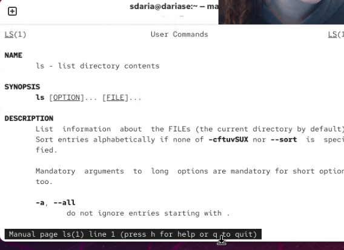{#fig-001 width=90%}

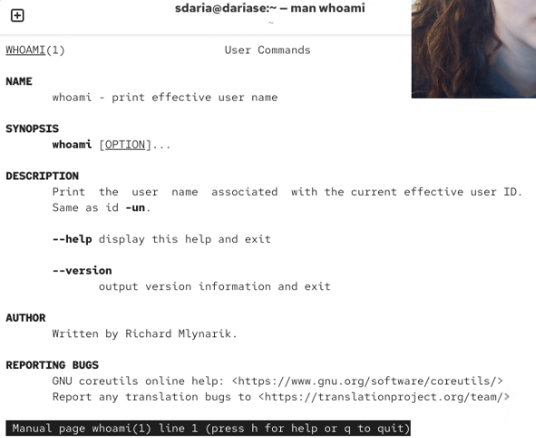{#fig-002 width=90%}

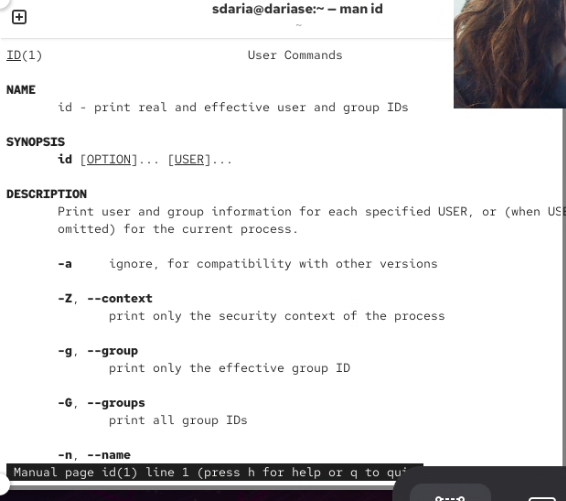{#fig-003 width=90%}

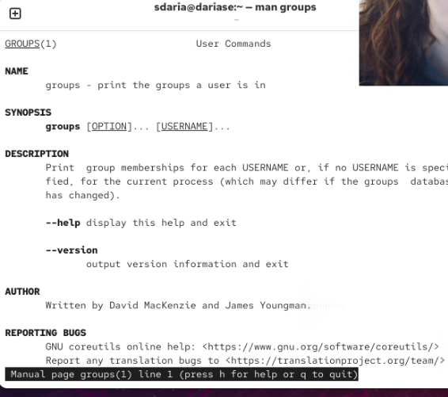{#fig-004 width=90%}

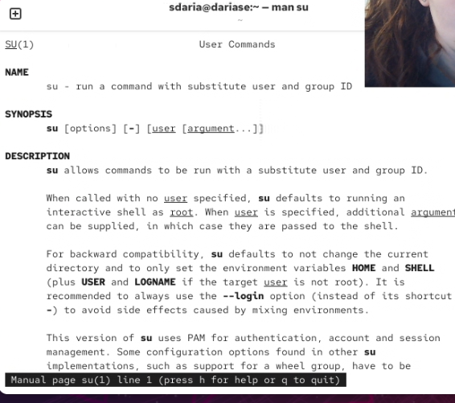{#fig-005 width=90%}

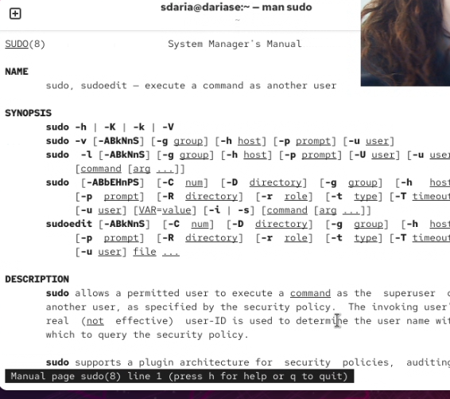{#fig-006 width=90%}

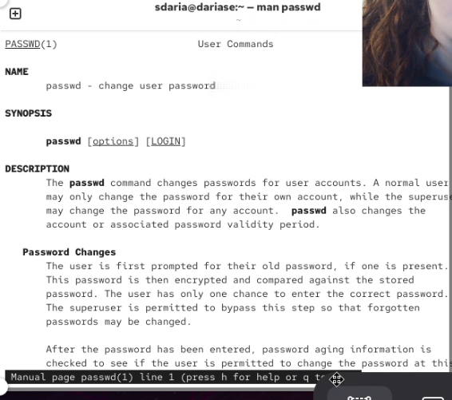{#fig-007 width=90%}

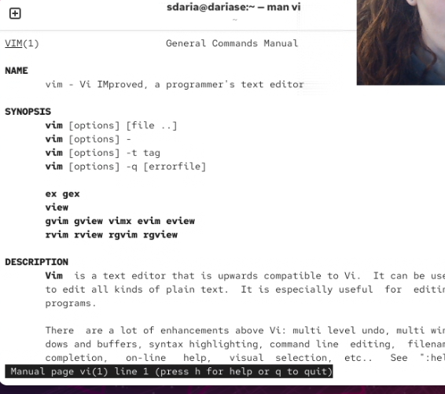{#fig-008 width=90%}

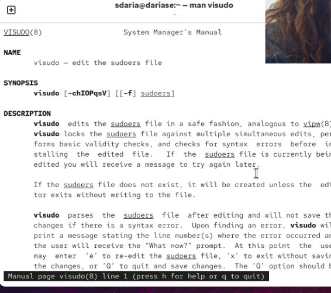{#fig-009 width=90%}

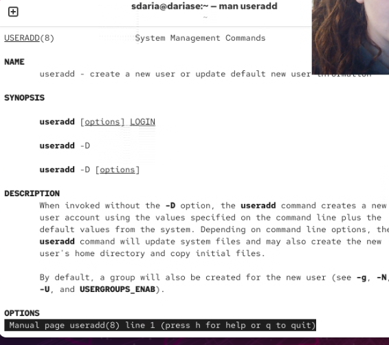{#fig-010 width=90%}

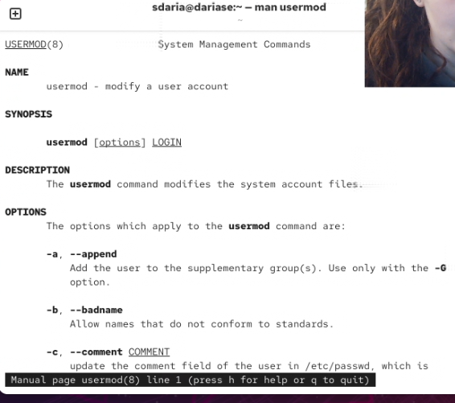{#fig-011 width=90%}

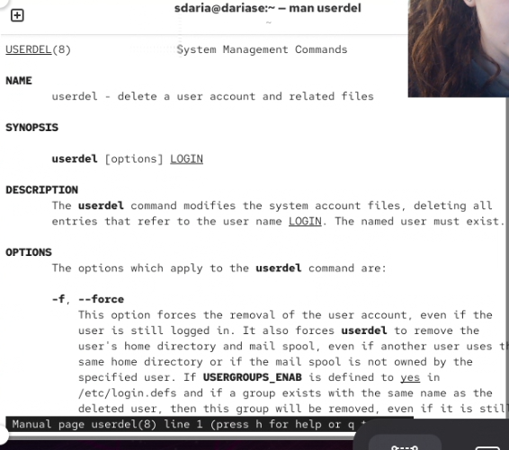{#fig-012 width=90%}

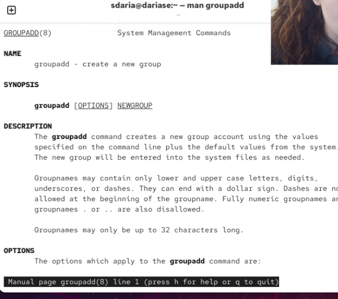{#fig-013 width=90%}

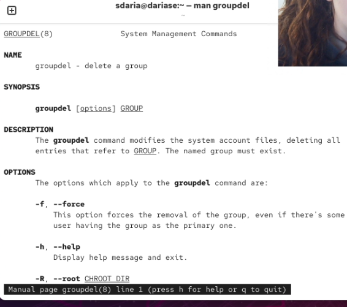{#fig-014 width=90%}

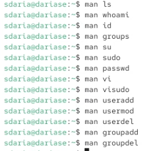{#fig-015 width=90%}

2. Переключение учётных записей пользователей.

Входим в систему под обычным пользователем, открываем терминал, определяем какую учётную запись 
используем и выводим более подробную информацию с помощью команд whoami и id.

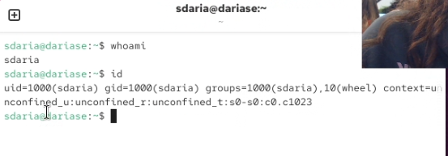{#fig-016 width=90%}

Мы получили информацию о пользователе и его группах.

Переключаемся на пользователя root и выводим подробную информацию о нём.

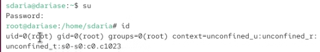{#fig-017 width=90%}

Возвращаемся к своей учетной записи и находим строку с %wheel в файле sudoers.

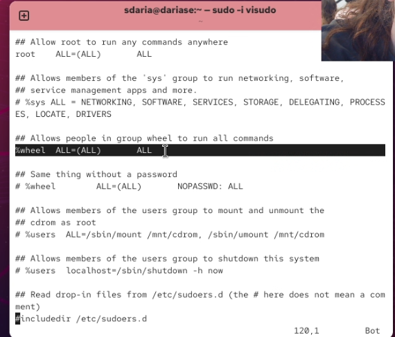{#fig-018 width=90%}

Строка обозначает, что все пользователи входят в группу WHEEL.

Далее создаём пользователя alice, входящего в группу wheel, задаём пароль и проверяем,
входит ли новый пользователь в группу wheel.

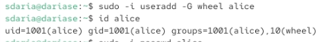{#fig-019 width=90%}

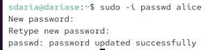{#fig-020 width=90%}

Переходим в новую учетную запись пользователя alice и создаём в нем новую - bob.

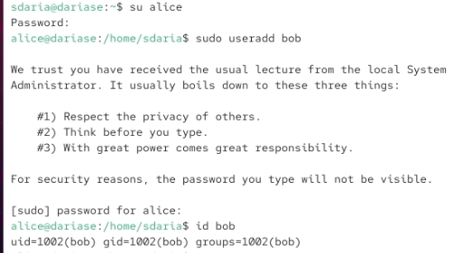{#fig-021 width=90%}

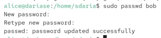{#fig-022 width=90%}

3. Создание учётных записей пользователей.

Переключаемся на пользователя root и открываем файл конфиурации для редактирования с помощью команды vim.

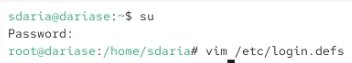{#fig-023 width=90%}

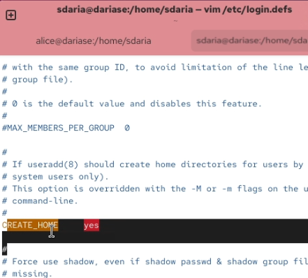{#fig-024 width=90%}

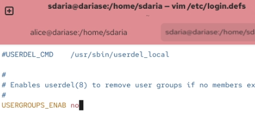{#fig-025 width=90%}

Далее переходим в каталог /etc/skel и создаем в нем новые каталоги.

Также открываем файл .bashrc для редактирования.

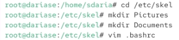{#fig-026 width=90%}

Добавляем строку export... в файл в режиме insert.

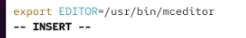{#fig-027 width=90%}

Далее переходим в уч. запись alice и создаём нового пользователя carol, задаём пароль.

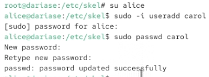{#fig-028 width=90%}

Далее смотрим информацию о пользователе carol, проверяем, что все все ранее созданные каталоги и внесённые изменения распространяются и на новых пользователей.

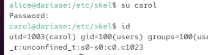{#fig-029 width=90%}

Пользователь carol dходит в первоначальную группу users.

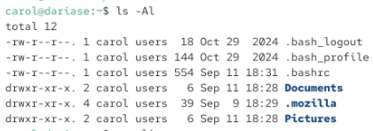{#fig-030 width=90%}

Далее переключаемся на пользователя alice, смотрим данные о пароле carol, изменяем их и смотрим ещё раз.

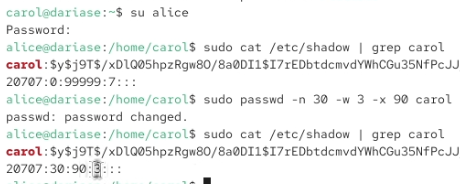{#fig-031 width=90%}

Мы изменили свойства срока действия пароля, кол-во дней до предупреждения и кол-во дней использованияя пароля.

Далее проверяем в каких файлах есть идентификаторы alice и carol.

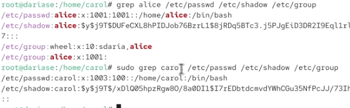{#fig-032 width=90%}

4. Работа с группами.

Далее работаем с группами, добавляем новые группы и добавляем в них новых и старых пользователей.

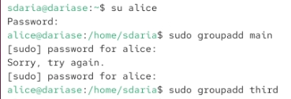{#fig-033 width=90%}

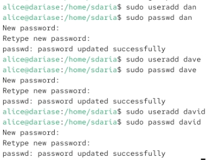{#fig-034 width=90%}

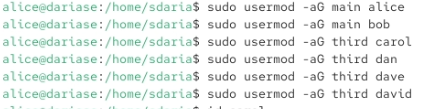{#fig-035 width=90%}

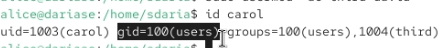{#fig-036 width=90%}

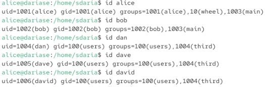{#fig-032 width=90%}

Пользователи alice и bob в группе main с идентификатором 1003. Остальные пользователи в группе third с идентификатором 1004.

# Выводы

Я получила представление о работе с учётными записями пользователей и группами пользователей в операционной системе типа Linux.

# Список литературы{.unnumbered}

::: 1. Робачевский А., Немнюгин С., Стесик О. Операционная система UNIX. — 2-е изд. —
БХВ-Петербург, 2010.
2. Колисниченко Д. Н. Самоучитель системного администратора Linux. — СПб. : БХВПетербург, 2011. — (Системный администратор).
3. Таненбаум Э., Бос Х. Современные операционные системы. — 4-е изд. — СПб. : Питер,
2015. — (Классика Computer Science).
4. Neil N. J. Learning CentOS: A Beginners Guide to Learning Linux. — CreateSpace Independent Publishing Platform, 2016.
5. Unix и Linux: руководство системного администратора / Э. Немет, Г. Снайдер, Т.
Хейн, Б. Уэйли, Д. Макни. — 5-е изд. — СПб. : ООО «Диалектика», 2020.
:::
